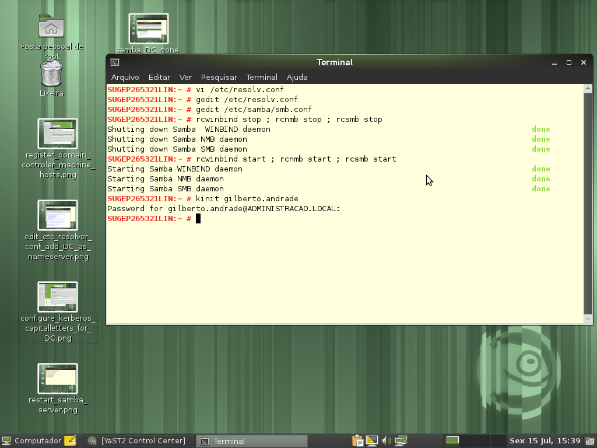

id=764
title=Linux - Participação no domínio do Windows 
date=2011-07-15 22:27:44
type=post
status=published
tags=Active Directory, kerberos, Linux, openSUSE, Sistema Operacional, Windows
~~~~~~

>
> Eu não quero compartilhar aquivo nenhum, apenas quero me logar no dominio MS, para assim usar internet, e-mail, enfim tudo que uma estação de trabalho com XP faria quando ingressa no dominio!
> Eu não quero criar um server com samba sem ser PDC E deixar na rede, quero apenas ao inves de usar o XP como estação de trabalho usar o openSUSE!
>

Este pedido de ajuda está registrado <a href="http://www.vivaolinux.com.br/topico/Suse/Linux-em-dominio-Windows" title="Linux em dominio Windows" target="_blank">aqui</a> na comunidade <a href="http://www.vivaolinux.com.br/" title="Viva o Linux" target="_blank">vivaolinux</a>. 

Apesar de ser uma discussão antiga, ainda assim é bom fazer um passo a passo deste procedimento. Antes devo relatar que aqui na secretaria usamos <a href="http://technet.microsoft.com/pt-br/library/cc668412.aspx" title="Active Directory" target="_blank">Active Directory</a> para autenticação, então foi esse ambiente que usei para testar a inclusão de uma estação <a href="http://pt.openSUSE.org/Portal:Distribui%C3%A7%C3%A3o" title="openSUSE" target="_blank">Linux openSUSE</a> em um Domínio Windows: 

  1. Registrar seu controlador de domínio(DC) na lista de nomes de máquinas. Adicione todo o nome qualificado primeiro e o apelido como alias: 192.168.1.2 = server.domain.com server  
    [][1] 
  2. Editar o arquivo /etc/resolv.conf e adicionar seu DC como nameserver: nameserver = server.domain.com  
    [][2] 
  3. Configure o kerberos através do yast: o realm deverá ser escrito em letra maiúscula: DOMAIN.COM  
    [][3] 
  4. Configura o samba  
    [][4]

    ```Shell
    SUGEP265338:~ # more /etc/samba/smb.conf 
    # smb.conf is the main Samba configuration file. You find a full commented
    # version at /usr/share/doc/packages/samba/examples/smb.conf.SUSE if the
    # samba-doc package is installed.
    # Date: 2011-11-02
    [global]
            add machine script = /usr/sbin/useradd -c Machine -d /var/lib/nobody -s /bin/false %m$
            domain master = No
            security = ADS
            workgroup = ADMINISTRACAO
            realm = ADMINISTRACAO.LOCAL
            idmap gid = 10000-20000
            idmap uid = 10000-20000
            usershare allow guests = No
            template homedir = /home/%D/%U
            winbind refresh tickets = yes
            template shell = /bin/bash
    [homes]
            comment = Home Directories
            valid users = %S, %D%w%S
            browseable = No
            read only = No
            inherit acls = Yes
    [profiles]
    ```    
    Não esqueça de reiniciar os serviços  
    [][5]
    
    Adicionar a máquina ao domínio (neste momento utilizando o kerberos)  
    [][6]</p> 

    net ads join -U Administrador  
    [][7] 
        
    Adicionar a máquina ao domínio (agora utilizando o samba): no yast use a opção:”Participação no domínio do windows”, marcando a opção “Usar informação SMB para autenticação Linux”  
    [][8] 

    Reinicie a máquina  
    [][9]
        
    Use com moderação! 
        
        

 [1]: 1-register_domain_controler_machine_hosts.png
 [2]: 2-edit_etc_resolver_conf_add_DC_as_nameserver.png
 [3]: 3-configure_kerberos_capitalletters_for_DC.png
 [4]: 4-samba_DC_none_workgroupname_domain_security_ads_realms.png
 [5]: 5-restart_samba_server.png
 [6]: 6-test_kerberos_autentication.png
 [7]: 7-join_ads_domain.png
 [8]: 8-windows_domain_membership.png
 [9]: 9-reboot_linux_client.png